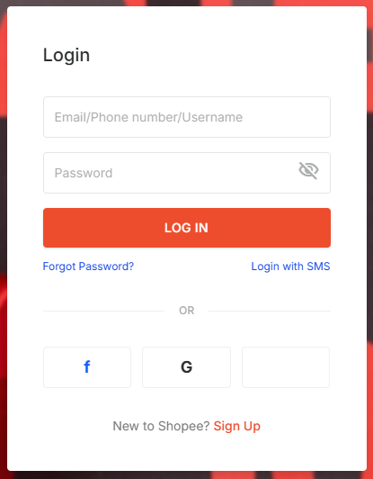
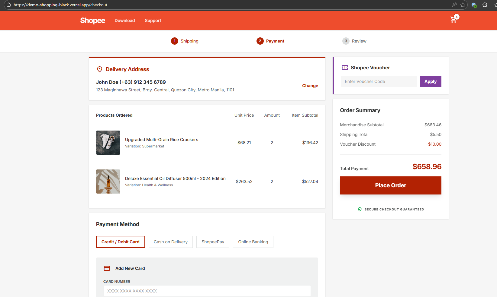
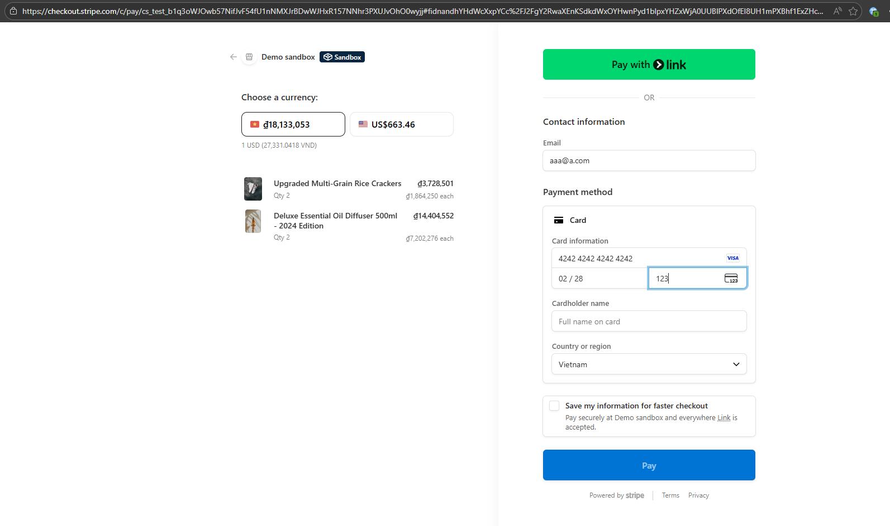

Shopee-style Demo Viewer

This folder contains a minimal static viewer for the screenshot assets used in the sample project.

Files added:

- `index.html` — simple gallery to preview images
- `styles.css` — basic layout styles
- `images/` — screenshot assets (login, home, cart, checkout, payment)

Quick inline preview from markdown viewers (GitLab/GitHub/VSCode):







To preview locally:

```bash
# from the repository root
cd Ecommerce/sample-1-github-copilot/demo
# start a simple HTTP server (Python 3)
python -m http.server 8000
# open http://localhost:8000 in your browser
```

GitLab / pushing:

1. Initialize git in this folder (or push from repo root). Example:

```bash
cd Ecommerce/sample-1-github-copilot/demo
git init
git add .
git commit -m "Add demo viewer and screenshots"
# create a GitLab repo and follow instructions to add remote, for example:
# git remote add origin git@gitlab.com:yourname/your-repo.git
# git push -u origin master
```

If you want, I can initialize a local git commit for you now and show the exact push commands to use with your GitLab remote.

Updated images (2026-03-30):

- `login.png` — 928,387 bytes
- `login-modal.png` — 928,387 bytes
- `home.png` — 371,704 bytes
- `cart.png` — 371,704 bytes
- `checkout.png` — 230,285 bytes
- `payment.png` — 230,285 bytes

These files were refreshed from `demo_shopping/stitch` on 2026-03-30.