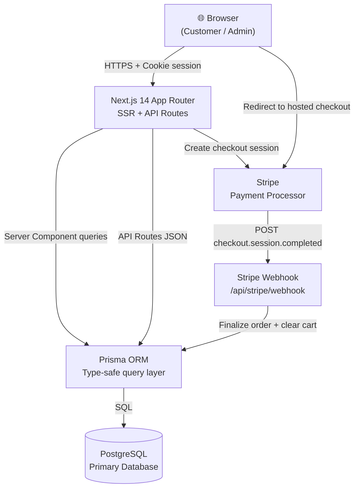

# Futurelink Ecommerce — Basic Design

> **Level 1 of 3** · High-level overview for stakeholders and new team members
> **Project**: `sample-6-antigravity` · **Stack**: Next.js 14 · TypeScript · Prisma · PostgreSQL · Stripe
> **Last Updated**: 2026-04-08

---

## 1. What the System Does

**Futurelink Ecommerce** is a full-stack, server-rendered online storefront that lets customers browse a product catalog, manage a persistent cart, and complete purchases via Stripe Checkout. Admins can manage product inventory and monitor sales from a protected dashboard.

| Dimension | Detail |
|---|---|
| **Primary Users** | Shoppers (browse, cart, buy), Administrators (inventory, orders, analytics) |
| **Core Value** | Fast, frictionless purchase flow with zero client-side state management complexity |
| **Business Model** | Direct-to-consumer e-tail; revenue via Stripe payment processing |

---

## 2. Main Features

| # | Feature | Description |
|---|---|---|
| 1 | 🏠 **Homepage** | Hero banner + featured product grid + category navigation |
| 2 | 🔍 **Product Search** | Full-text search with category filtering + paginated results |
| 3 | 📦 **Product Detail** | Image gallery, description, inventory status, add-to-cart |
| 4 | 🛒 **Cart** | Slide-over panel, quantity controls, running totals with 8% tax |
| 5 | 💳 **Stripe Checkout** | Hosted checkout session → webhook-driven order fulfillment |
| 6 | 📋 **Order History** | Authenticated user order list with payment status |
| 7 | 🔐 **Auth** | Email/password registration & login with HMAC-signed cookie sessions |
| 8 | 🛡️ **Admin Dashboard** | Revenue summary, product management (CRUD), recent orders |

---

## 3. User Flow

### Shopper Flow

```
1.  Land on Homepage
      → Browse hero banner, featured products, category nav

2.  Go to Search / "Shop the Collection"
      → Filter by keyword or category
      → Browse paginated product grid

3.  Click a Product Card
      → View product detail page (images, description, price, inventory status)

4.  Click "Add to Cart"
      → Cart slide-over opens
      → Shows item, quantity controls, subtotal + tax + total

5.  Click "Checkout"
      → Redirected to Stripe-hosted payment page

6.  Complete payment on Stripe
      → Stripe redirects back to /orders

7.  Stripe webhook fires (background)
      → Order marked PAID
      → Inventory decremented
      → Cart cleared
```

### Admin Flow

```
1.  Log in with admin credentials
      → Redirected to /admin dashboard

2.  View Dashboard
      → Total revenue, paid orders count, active products, low-stock alerts

3.  Navigate to Products
      → View full product catalog list

4.  Click Edit on a product
      → Update price, description, inventory count, featured flag

5.  Save changes
      → Immediately reflected on the storefront
```

---

## 4. Tech Stack

| Technology | Version | Reason |
|---|---|---|
| **Next.js 14 (App Router)** | 14.2.30 | Server Components enable direct DB access — no extra API layer needed for SSR |
| **TypeScript** | ^5 | End-to-end type safety from DB schema to React components via Zod contracts |
| **Prisma ORM** | ^6.19.3 | Type-safe DB client with schema-first migrations; eliminates raw SQL |
| **PostgreSQL** | latest | Relational integrity for orders/payments; ACID transactions for cart→order handoff |
| **Stripe** | ^22.0.0 | Industry-standard hosted checkout; webhook model prevents double-charge races |
| **Zod** | ^4.3.6 | Runtime schema validation for all API inputs and shared DTO contracts |
| **TailwindCSS** | ^3.4.1 | Utility-first CSS keeps component styles co-located; zero runtime overhead |
| **Lucide React** | ^1.7.0 | Consistent, tree-shakable SVG icon set |
| **clsx** | ^2.1.1 | Conditional class name merging without string concatenation |

---

## 5. System Components Diagram



---

## 6. Related Documents

| Document | Path |
|---|---|
| Very Detail Design (Level 2) | [`2-DETAIL-DESIGN.md`](./2-DETAIL-DESIGN.md) |
| Architecture Design (Level 3) | [`3-ARCHITECTURE-DESIGN.md`](./3-ARCHITECTURE-DESIGN.md) |
