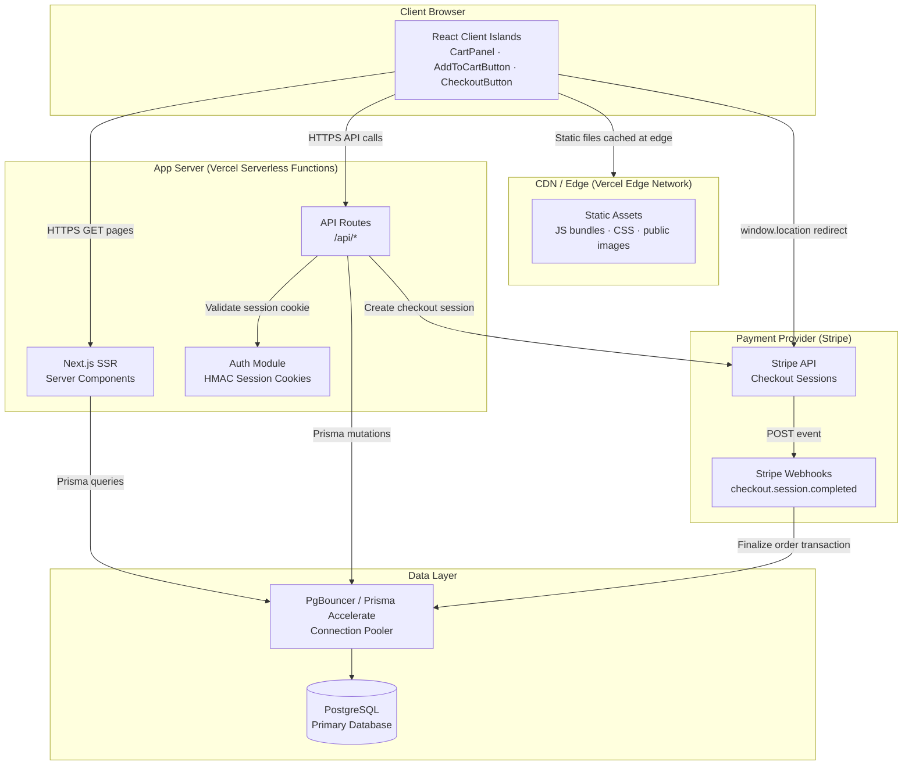
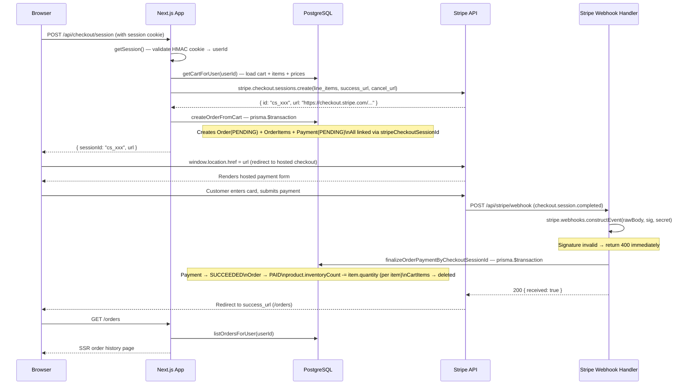
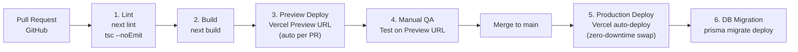

# Futurelink Ecommerce — Architecture Design

> **Level 3 of 3** · Long-term, scalable system design for architects and DevOps
> **Project**: `sample-6-antigravity` · **Stack**: Next.js 14 · TypeScript · Prisma · PostgreSQL · Stripe
> **Last Updated**: 2026-04-08

---

## Table of Contents

1. [Architecture Pattern](#1-architecture-pattern)
2. [Infrastructure Diagram](#2-infrastructure-diagram)
3. [Data Flow: End-to-End Request](#3-data-flow-end-to-end-request)
4. [Scalability Plan](#4-scalability-plan)
5. [Security Architecture](#5-security-architecture)
6. [CI/CD Pipeline](#6-cicd-pipeline)
7. [Observability](#7-observability)
8. [Failure Modes & Recovery](#8-failure-modes--recovery)

---

## 1. Architecture Pattern

**Pattern: Modular Monolith**

The application is a single deployable Next.js process with clear, enforced internal module boundaries.

### Module Map

| Module | Path | Responsibility |
|---|---|---|
| **Presentation** | `app/` Server Components | SSR page rendering with direct data access via Prisma |
| **API** | `app/api/` Route Handlers | JSON endpoints for all client-side mutations |
| **Data Access** | `lib/data.ts` | All Prisma queries + domain logic (tax calc, order finalization) |
| **Auth** | `lib/auth.ts` | Session lifecycle, password hashing, role guards |
| **Contracts** | `lib/contracts.ts` | Zod schemas as shared, validated API contracts |
| **UI** | `components/` | React component tree (Server + Client components) |

### Why Modular Monolith — Not Microservices

| Consideration | Decision |
|---|---|
| **Team size** | 1–5 engineers; microservices operational overhead (K8s, service mesh, distributed tracing) is not yet justified |
| **Performance** | Next.js Server Components avoid client-server round trips — the primary benefit of service decomposition is already captured |
| **PCI compliance** | Stripe Checkout offloads all card data handling — no dedicated payments microservice needed |
| **Future extraction** | Module boundaries are clean: `lib/data.ts` + `lib/auth.ts` can be extracted into independent services when traffic demands it |

---

## 2. Infrastructure Diagram



---

## 3. Data Flow: End-to-End Request

### Full Purchase Sequence (Checkout → Webhook → Confirmation)



---

## 4. Scalability Plan

### Traffic Tiers

| Tier | Traffic | Strategy |
|---|---|---|
| **Startup** | < 1k req/min | Single Vercel deployment + hosted PostgreSQL (Railway / Supabase). No changes needed. |
| **Growth** | 1k–10k req/min | Add Redis cache for product catalog. Enable `revalidate` on homepage Server Components. Use Prisma Accelerate for connection pooling. |
| **Scale** | 10k–100k req/min | PostgreSQL read replica for all SELECT queries. ISR on product detail pages. Extract cart/checkout mutations into a dedicated service with Redis as primary cart store. |
| **Enterprise** | 100k+ req/min | Full service decomposition. Async order processing via message queue (SQS / BullMQ). Event-driven inventory updates. |

### Caching Strategy

| Cache Target | Mechanism | TTL | Notes |
|---|---|---|---|
| Homepage product listings | `next/cache` with `revalidate = 60` | 60 seconds | Stale-while-revalidate |
| Product detail pages | ISR (Incremental Static Regeneration) | 300 seconds | Regenerated on next request after expiry |
| Category list | Next.js request memoization (auto dedup) | Per-request | No config needed |
| User sessions | Self-contained signed cookie (stateless) | 7 days | No server-side session store required |
| Cart data | Not cached | n/a | Always fetched fresh — must be accurate |

### CDN Strategy

| Asset Type | CDN Handling |
|---|---|
| JS bundles, CSS | Served from Vercel Edge CDN globally; long-lived `Cache-Control: immutable` |
| Public images | Served from origin URLs (Unsplash); migrate to `next/image` for automatic WebP + responsive sizes |
| HTML pages | Not CDN-cached (personalized / auth-gated) |
| API responses | Not CDN-cached (mutable state) |

### Connection Pooling

- **Dev**: Direct Prisma connections (max 5 concurrent)
- **Production**: PgBouncer in transaction mode, or **Prisma Accelerate** — required when Vercel serverless function concurrency exceeds PostgreSQL's default `max_connections` (100)

---

## 5. Security Architecture

### 5.1 Auth Boundaries

```
Public (no auth required):
  GET /
  GET /products/*
  GET /search
  GET /login
  GET /register

Session cookie required:
  GET  /cart
  GET  /orders
  GET  /api/cart
  POST /api/cart
  PATCH /api/cart
  POST /api/checkout/session
  POST /api/auth/logout

Admin role required (session + role=ADMIN):
  GET  /admin
  GET  /admin/products
  (enforced server-side by requireAdminProfile())

Stripe HMAC signature required (no session cookie):
  POST /api/stripe/webhook
```

### 5.2 Session Cookie Security

| Property | Value | Why |
|---|---|---|
| `HttpOnly` | `true` | JavaScript cannot read the cookie — XSS cannot steal sessions |
| `SameSite` | `Lax` | Prevents CSRF from cross-site POST requests |
| `Secure` | `true` in production | Cookie only sent over HTTPS |
| `Path` | `/` | Valid for all routes |
| `Expires` | 7 days absolute | Embedded in payload body AND cookie header |
| Signature | HMAC-SHA256 | Changing any byte in the payload body invalidates the signature |
| Comparison | `timingSafeEqual` | Constant-time — prevents timing-based signature inference |

### 5.3 Password Security

| Concern | Implementation |
|---|---|
| Storage | PBKDF2-SHA256, 100k iterations, 64-byte output key |
| Salt | 16 bytes cryptographically random per user (hex-encoded) |
| Enumeration prevention | Both "wrong email" and "wrong password" return `"Invalid email or password"` |
| Plaintext | Never stored at any point |

### 5.4 Stripe Webhook Security

| Step | Detail |
|---|---|
| 1. Receive raw body | `req.text()` — parsed before any JSON processing |
| 2. Read Stripe signature header | `stripe-signature` |
| 3. Verify via SDK | `stripe.webhooks.constructEvent(rawBody, sig, STRIPE_WEBHOOK_SECRET)` |
| 4. On failure | Return `400` immediately — no DB operations performed |
| 5. Idempotency | `finalizeOrderPaymentByCheckoutSessionId()` returns early if order is already `PAID` |

### 5.5 Secrets Management

| Secret | Where Stored | Access Pattern |
|---|---|---|
| `AUTH_SECRET` | `.env` / Vercel environment | Read once at request time via `getSecret()` in `lib/session.ts` |
| `STRIPE_SECRET_KEY` | `.env` / Vercel environment | Accessed via `getStripeSecretKey()` — throws if missing |
| `STRIPE_WEBHOOK_SECRET` | `.env` / Vercel environment | Accessed via `getStripeWebhookSecret()` — throws if missing |
| `DATABASE_URL` | `.env` / Vercel environment | Used by Prisma at startup |

> [!CAUTION]
> Never log secrets. Never commit `.env` to version control. Rotate `AUTH_SECRET` if leaked — this immediately invalidates all active user sessions.

### 5.6 Rate Limiting (Recommended)

| Endpoint | Limit | Tool |
|---|---|---|
| `POST /api/auth/login` | 5 attempts / IP / 15 min | `@upstash/ratelimit` + Vercel Edge Middleware |
| `POST /api/auth/register` | 3 registrations / IP / hour | Same |
| `POST /api/stripe/webhook` | Trust Stripe infrastructure; no limit needed | — |

---

## 6. CI/CD Pipeline



### Stage Details

| Stage | Tool | What Runs | Failure Condition |
|---|---|---|---|
| **Lint** | ESLint (`eslint-config-next`) + `tsc --noEmit` | Static analysis + full type-check | Any ESLint error or TypeScript type error |
| **Build** | `next build` | Compiles all pages, validates Server Component data shapes | Missing env vars, import errors, type errors |
| **Preview Deploy** | Vercel | Auto-deploys to isolated preview URL per PR | Build failure |
| **Production Deploy** | Vercel (on `main` push) | Serverless function swap — zero downtime | Build failure |
| **DB Migration** | `prisma migrate deploy` | Applies pending schema migrations | Schema drift or SQL error — deploy rolls back |

### Environments

| Environment | Branch | Database | Stripe Keys |
|---|---|---|---|
| **Development** | `local` | `localhost:5432/futurelink` | `sk_test_*` / `pk_test_*` |
| **Preview** | feature branches | Vercel Postgres (isolated per PR) | `sk_test_*` / `pk_test_*` |
| **Production** | `main` | Managed PostgreSQL (Railway / RDS / Supabase) | `sk_live_*` / `pk_live_*` |

---

## 7. Observability

### 7.1 Logging

| Log Type | Where | What |
|---|---|---|
| **Request logs** | Vercel Runtime Logs (automatic) | Function invocations, HTTP status, duration, memory |
| **Application errors** | `console.error(e)` in all API `catch` blocks | Full error message + stack trace for Prisma and unexpected errors |
| **Webhook outcomes** | `console.log(event.type, result.reason, orderId)` | Event type + finalization outcome (or skip reason) |
| **Auth failures** | Not logged by default | Add `console.warn` on failed login for security audit trail |

### 7.2 Metrics

| Metric | Tool | Alert Threshold |
|---|---|---|
| API 5xx error rate | Vercel Analytics / Datadog | > 1% of requests over any 5-minute window |
| DB query latency p99 | Prisma Pulse / PgHero | > 500ms |
| Checkout conversion rate | Stripe Dashboard | > 20% drop week-over-week |
| Payment success rate | Stripe Dashboard | < 95% over any 1-hour window |
| Webhook delivery failures | Stripe Dashboard built-in alerts | Any delivery failure triggers Slack/email alert |

### 7.3 Distributed Tracing (Recommended for Scale)

- Add `@vercel/otel` (OpenTelemetry) to trace the full SSR → Prisma query chain
- Instrument Stripe API calls with span IDs for cross-system correlation
- Export traces to Datadog APM, Grafana Tempo, or Honeycomb

---

## 8. Failure Modes & Recovery

| Failure | User Impact | Recovery Strategy |
|---|---|---|
| **PostgreSQL unavailable** | All pages return 500; site is completely down | DB provider SLA covers restart (< 1 min for Railway/Supabase); add Prisma connection retry with exponential backoff; show static maintenance page via Vercel maintenance mode |
| **Stripe API down during checkout** | User cannot start checkout; sees error message | `POST /api/checkout/session` catches the error and returns `{ error: "Payment temporarily unavailable" }`; Order is **not** created — no orphan records |
| **Stripe webhook delivery failure** | Order stays `PENDING`; cart not cleared | Stripe auto-retries for 72 hours with exponential backoff; `finalizeOrderPaymentByCheckoutSessionId()` is fully idempotent — any replay is a safe no-op |
| **Payment failed after order created** | Orphan `PENDING` Order in DB | Handle `payment_intent.payment_failed` Stripe event → mark Payment→`FAILED`, Order→`CANCELED`; notify user via email |
| **Double webhook delivery** | Risk of double inventory decrement | Idempotency guard: `if order.status === PAID → return ALREADY_FINALIZED`; Prisma `$transaction` is atomic — no partial state possible |
| **`AUTH_SECRET` rotated or leaked** | All active sessions immediately invalidated | Rotate secret in Vercel environment variables; all users are signed out; communicate via status page; schedule rotation at off-peak hours |
| **Admin account compromised** | Full catalog and order read/write access | Rotate `AUTH_SECRET` immediately (signs out everyone); audit `UserProfile` for unauthorized `role=ADMIN` rows; review all order/product mutations in Vercel logs |
| **Vercel cold start latency** | First request after idle: 100–500ms added latency | Acceptable at current scale; mitigate with Vercel Fluid Compute or Edge Runtime for high-traffic routes (product listing, homepage) |
| **Slow DB query / function timeout** | Specific page times out (Vercel 10s default) | Identify slow query via Prisma query logs; add missing index (e.g. `Product.categoryId`, compound `CartItem.[cartId, productId]`); increase timeout in `next.config.mjs` if needed |

---

## Related Documents

| Document | Path |
|---|---|
| Basic Design (Level 1) | [`1-BASIC-DESIGN.md`](./1-BASIC-DESIGN.md) |
| Very Detail Design (Level 2) | [`2-DETAIL-DESIGN.md`](./2-DETAIL-DESIGN.md) |
